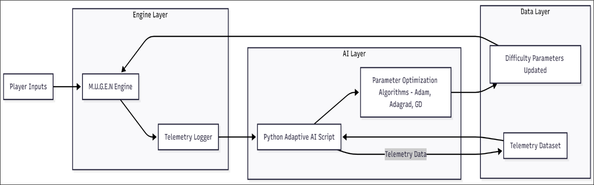
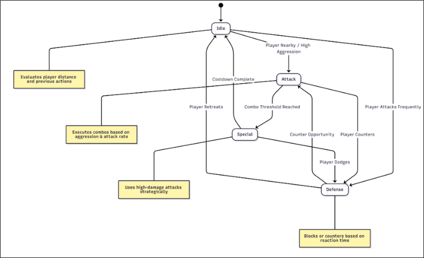

# 🎮 BossForge: Developing an Adaptive AI for Dynamic Game Difficulty

**BossForge** is a 2D single-player fighting game built on the **M.U.G.E.N** engine, powered by an **adaptive AI** that dynamically adjusts the boss's difficulty in real time based on player performance.  
By combining **real-time telemetry analysis**, **gradient-based optimization algorithms** (Adam, Adagrad, Gradient Descent), and a **Finite State Machine (FSM)** behavior model, BossForge delivers an engaging, personalized gameplay experience.

---

## 🧠 Key Features

- 🕹️ **Adaptive Difficulty** — AI continuously adjusts aggression, attack rate, and reaction time
- ⚙️ **Optimization Algorithms:** Gradient Descent, Adagrad, and Adam
- 🧩 **Modular Architecture:** Game engine separated from AI logic for scalability
- 📊 **Real-Time Telemetry:** Live feedback loop between gameplay and learning system
- 🔍 **Explainable AI:** Every difficulty change is data-driven and traceable
- 💾 **FSM-Based Behavior Control:** Adaptive state transitions for realistic boss logic

---

## 🏗️ System Architecture



### Architecture Overview

BossForge uses a decoupled framework that separates gameplay from AI logic:

1. **M.U.G.E.N Game Engine** – Runs the fighting game and logs telemetry (player & boss actions, outcomes).
2. **Telemetry Interface** – Structured `.txt` files act as a bridge between game engine and AI script.
3. **Python AI Script** – Reads telemetry, computes optimized difficulty parameters, and updates `.cns` configuration files.
4. **Optimization Module** – Applies algorithms like Adam to fine-tune boss behavior dynamically.

---

## 🧩 AI Behavior Framework



### Core Modules

- **Telemetry Extraction:** Captures reaction time, attack frequency, and win/loss ratio per match.
- **Optimization Module:** Uses Adam/Adagrad to minimize deviation from target win rate.
- **FSM Logic:** Controls boss behavior with states — _Idle_, _Attack_, _Defense_, _Special_.
- **Parameter Update Loop:** Continuously adjusts aggression, reaction time, and attack rate after every round.

---

## 🧮 Adaptive Learning Algorithm

### Adam Optimizer Pseudocode

```text
Initialize learning rate (α), exponential decay rates (β₁, β₂), and ε
For each session:
    Compute gradient gₜ of loss L(θₜ)
    Update biased first moment: mₜ = β₁*mₜ₋₁ + (1−β₁)*gₜ
    Update biased second moment: vₜ = β₂*vₜ₋₁ + (1−β₂)*gₜ²
    Bias-correct m̂ₜ = mₜ/(1−β₁ᵗ), v̂ₜ = vₜ/(1−β₂ᵗ)
    Update parameters: θₜ₊₁ = θₜ − α*(m̂ₜ / (√v̂ₜ + ε))
```

## 📊 Experimental Results

| Metric                             | Gradient Descent | Adagrad | Adam  |
| :--------------------------------- | :--------------- | :------ | :---- |
| Convergence Time (epochs)          | 450              | 310     | 190   |
| Mean Squared Error (Loss)          | 0.042            | 0.028   | 0.015 |
| Target Win Rate Accuracy           | 81.2%            | 86.7%   | 93.4% |
| Stability (Oscillation %)          | 14.5             | 9.8     | 3.2   |
| Computational Efficiency (ms/iter) | 11.2             | 9.3     | 8.1   |

Adam Optimizer achieved the most balanced and smooth gameplay experience with minimal oscillation.

---

## 📈 Visual Insights

| Visualization                                 | Description                                    |
| :-------------------------------------------- | :--------------------------------------------- |
| Frontend view of BossForge gameplay           | Real-time telemetry data collected from fights |
| AI parameter tuning and performance dashboard | Player win rate before vs after adaptation     |
| Adaptive boss reaction time improvement       | Relationship among telemetry features          |

---

## ⚙️ Technologies Used

| Category                | Tools                             |
| :---------------------- | :-------------------------------- |
| Game Engine             | M.U.G.E.N                         |
| Programming Language    | Python 3.10                       |
| AI/ML Libraries         | NumPy, Pandas, Matplotlib         |
| Optimization Algorithms | Gradient Descent, Adagrad, Adam   |
| Visualization           | Matplotlib, custom dashboard      |
| Explainability          | Telemetry-based parameter mapping |

---

## 🧪 Evaluation Highlights

- Real-time validation replaces k-fold testing for sequential game data.
- Smooth difficulty transitions → reduced player frustration.
- Player win rate improved from 15% → 45% post adaptation.
- Consistent frame rate: 60 FPS maintained during AI updates.

---

## 🚀 Future Enhancements

- Multi-character and arena expansion
- Reinforcement Learning integration for deeper adaptation
- Multiplayer adaptive AI for competitive play
- Explainability dashboards for player transparency

---

## 👩‍💻 Team

| Name            | Reg. No.        | Email                |
| :-------------- | :-------------- | :------------------- |
| Disha BR        | A2212701010006  | db6793@srmist.edu.in |
| Jerin Klaudia A | RA2212701010026 | ja9103@srmist.edu.in |
| Aaditva Chauhan | RA2211047010141 | ac5462@srmist.edu.in |

---

## 📚 References

A full list of research references is available in `docs/Final_Report.pdf`

---

## 🪪 License

This project is released under the MIT License.

You’re free to use, modify, and distribute it with proper attribution.

---

## 🌟 Acknowledgement

Developed as part of 21AIC402T - Design of Artificial Intelligence Products under the Department of Computational Intelligence,
School of Computing, SRM Institute of Science and Technology, Kattankulathur (2025).
